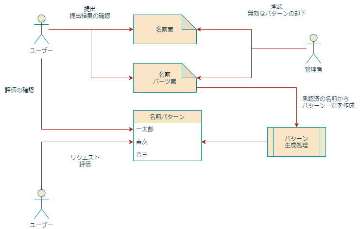

# 名前パターン生成

## 行いたいこと

- 承認済の名前案や名前パターンから実際に使用する名前の一覧を作成したい
- 名前に対し評価が行われた場合、提案したユーザーに対し評価点が付くようにしたい
    - 名前案の場合は 10 点
    - パターンの場合は 1 点のようにしたい
- 評価を付けられるように、名前には基になるユーザーの情報を紐づけておきたい
    - 名前パターンの場合は prefix/suffix があるので、複数ユーザーが紐付く可能性がある
    - 通常の名前に対し複数の名前を紐付けてしまうと全ての名前に紐付けるようなことが出来てしまうので、
      通常の名前は先勝ちにする
- 匿名の投稿も可能にするため、この場合は評価は付かない
- 漢字の名前に対しては読み仮名もあった方が良い
- 評価は取り消すこともあるため、名前パターン ID と付与ユーザー ID で紐づける。
    - ユーザー毎の評価数は初期は都度計算して算出する
    - 将来的にはワーカーを使用して評価変動時にRedisにキャッシュさせる構造を検討する

## 用語の整理

| 用語                | 意味                                                                         |
| ------------------- | ---------------------------------------------------------------------------- |
| 名前案              | ユーザーが提出する名前のアイデアの一つ。「市之介」のように完結した名前。     |
| 名前パーツ案        | ユーザーが提出する名前のアイデアの一つ。「接尾辞：之介」のように名前の一部。 |
| 承認済名前/パーツ案 | 管理者が承認済の名前やパーツの案                                             |
| 名前パターン        | システムが名前案やパーツから生成した、使用可能な名前の一覧                   |

## フロー

## データモデル

- 名前案 (※承認済かどうかはテーブルを分けて管理する)
    - 名前
    - 読み仮名
    - 申請ユーザー ID

- 名前パーツ
    - 名前
    - 読み仮名
    - 位置フラグ
    - 申請ユーザー ID

- 名前パターン
    - 名前
    - 生成元名前案 ID
    - 生成元名前パーツ ID1
    - 生成元名前パーツ ID2

- 評価
    - 名前パターン ID
    - 評価ユーザー ID
